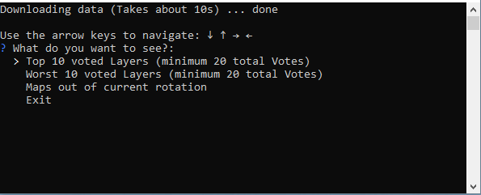

# We Love Squad Vote Analyser

This application gives a simple vote analysis for We Love Squad server statistics pulled from https://mapvote.welovesquad.de/.



# Download the latest release

You can download the latest release for windows from [releases](https://github.com/xEtarusx/wls-vote-analyser/releases) 

# Build it yourself

* Clone the repository
* Download golang from https://go.dev/dl/
* Build it with ```go build .``` or run it directly with ```go run .```